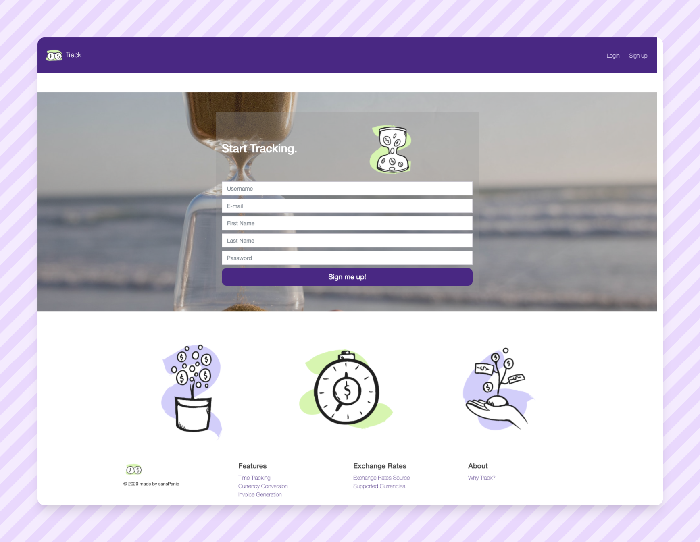
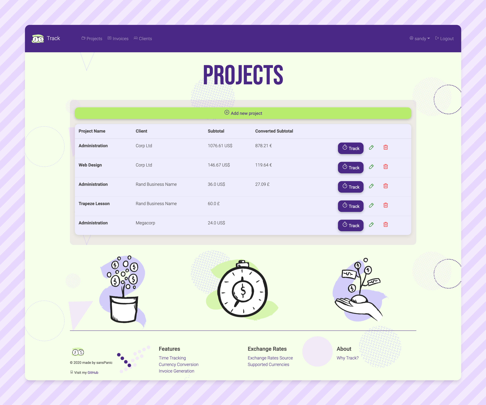
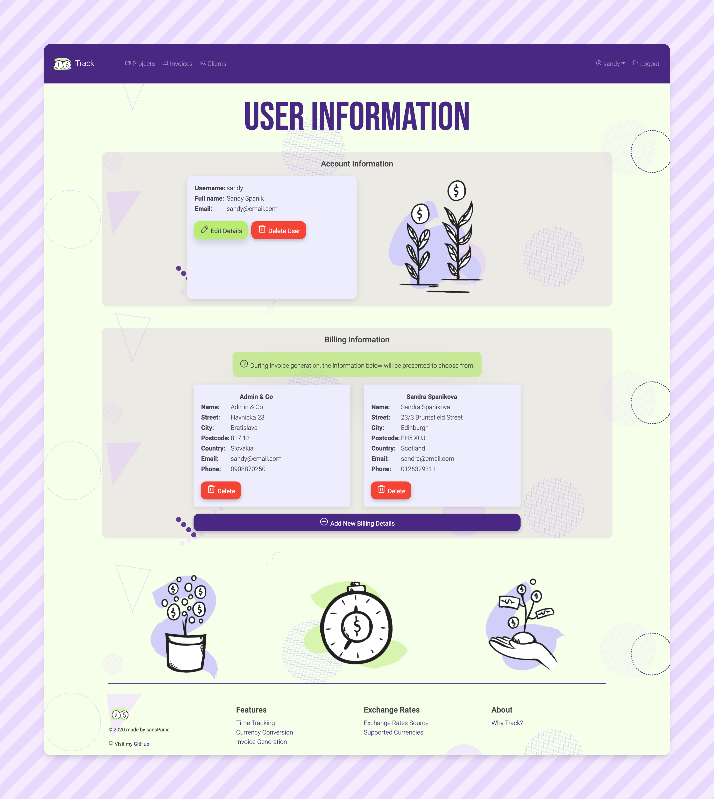

# TRACK
#### :hourglass: Timekeeping & invoice generation for international contractors

Link to deployed app: [TRACK](https://track-work-logger.herokuapp.com/).

Track is my first project, submitted as part of the [Springboard Software Engineering Bootcamp](https://www.springboard.com/). 

The tool is meant for self-employed contractors who work on an hourly basis. Its features include: 
 
* Time-keeping across multiple projects and clients
* Conversion of time spent working into money earned
* If invoicing in foreign currency: __fair__ conversion of money earned into foreign currency _on the day work was done_, rather than bulk conversion at the end of invoice period susceptible to exchange rate fluctuations
* Automatic PDF invoice generation including optional extra charge, discount and VAT

# Technologies 

### :snake: Python Backend

1. Flask
2. PostgreSQL
3. SQLAlchemy
4. WTForms
5. Forex-python
6. Flask-Bcrypt

### :bee: JavaScript Frontend
5. Almost exclusively vanilla JS for DOM Manipulation, minimal jQuery
6. Bootstrap
7. html2pdf.js

# Credits

1. Icons by [phosphor](https://phosphoricons.com/)
2. SVG background by [BGjar](https://bgjar.com/)
3. Illustrations by [pixeltrue](https://www.pixeltrue.com/)

# Screenshots

### Landing Page. 

### Registration Page.

### Projects View.

### User Info View.

### Invoice View.

### Track View.

